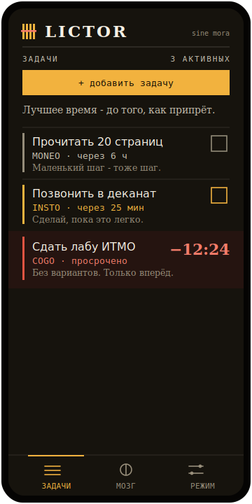

# Lictor

Агрессивный менеджер напоминаний и задач, который не отстаёт. Эскалация по тирам **MONEO → INSTO → COGO** и адаптивный «Мозг», который учится, когда и как тебя дожимать.

<p>
  <a href="https://vincere-mori.github.io/lictor/">
    
  </a>
  <a href="https://github.com/vincere-mori/lictor/releases/latest">
    
  </a>
</p>

## Идея

Обычный список дел показывает задачи и забывает о них. Lictor дожимает: напоминание усиливается, пока ты не сделаешь, и подстраивается под тебя.

## Возможности

- **Эскалация** — MONEO (тихо) → INSTO (напор, повторы) → COGO (full-screen алярм; отложить можно только удержанием, не смахнуть).
- **Адаптивный «Мозг»** — считает, в какие часы ты реально закрываешь дела, и ставит туда задачи, у которых не задано точное время.
- **Наставления** — у каждой задачи своя строка в характере её тира, плюс контекстные цитаты (стоики и голос ликтора) на экране списка и на аляр­ме.
- **Быстрый ввод** — время понимается из текста («зал завтра 18:00»), важность (тир) выбираешь кнопкой.
- **4 темы** — две тёмные (Чернила, Гранит) и две светлые (Пергамент, Мрамор).
- **Жесты и офлайн** — свайп вправо «готово», влево «позже»; всё хранится локально (IndexedDB), работает без сети.

## Платформы

- **iPhone** — PWA на GitHub Pages (добавь на экран Домой). Уведомления ограничены вебом iOS.
- **Android** — нативная сборка (Capacitor): локальные уведомления с каналами по тирам, переживают закрытие. APK в релизах.

## Стек

React + TypeScript + Vite, Framer Motion, Dexie, Zustand, PWA. Android — Capacitor. Пуш для iOS — FastAPI на VPS (в работе).

## Разработка

```
npm install
npm run dev
npm test
npm run build
```

## Превью


